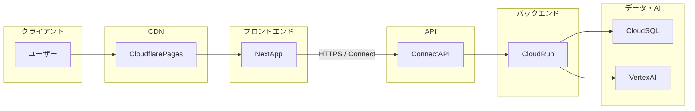
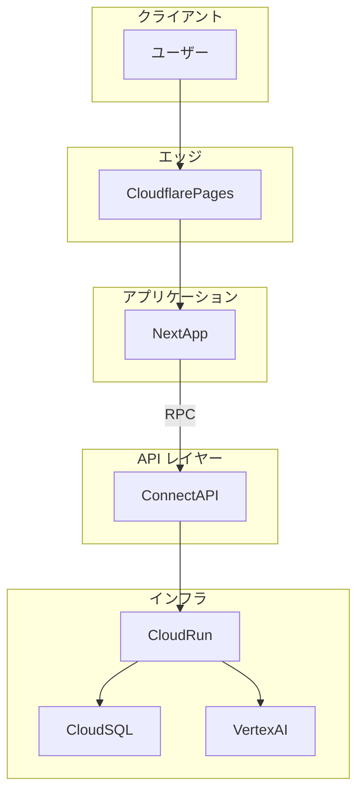
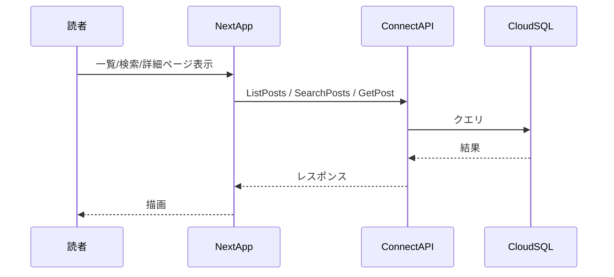
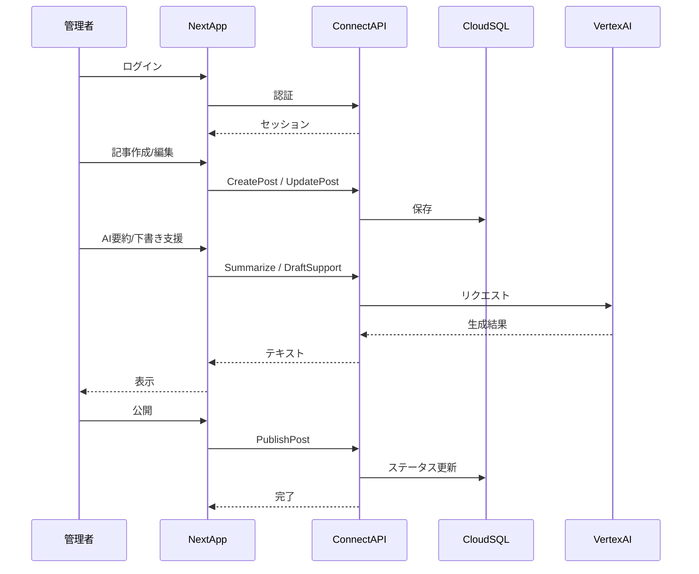

# 個人ブログシステム アーキテクチャ設計書

## 1. システム概要

本システムは、管理者が記事を執筆・公開し、読者が一覧・検索・本文閲覧を行う個人ブログである。Markdown ベースのコンテンツ管理と、Vertex AI (Gemini) による要約・下書き支援を提供する。フロントエンドは Cloudflare Pages、API およびバックエンドは GCP Cloud Run、データ永続化は Cloud SQL (MySQL) で運用する。

---

## 2. アーキテクチャ概要図

---

## 3. コンポーネント説明

### フロントエンド (Next.js / TypeScript)

- **役割**: 読者向け・管理者向けの UI とルーティングを提供する。
- **責務**:
  - 静的ページおよび SSR による記事一覧・詳細・検索結果の表示。
  - `@connectrpc/connect` により proto から自動生成したクライアントで API と通信。
  - 管理者の記事作成・編集（Markdown エディタ）、AI 要約・下書き支援の呼び出し UI。

### CDN (Cloudflare Pages)

- **役割**: フロントエンドの配信とキャッシュをエッジで行う。
- **責務**:
  - Next.js のビルド成果物のホスティング。
  - 静的アセットのキャッシュとエッジ配信によるレイテンシ低減。
  - HTTPS およびカスタムドメインの提供。

### API (connect-go on Cloud Run)

- **役割**: 記事・タグ・検索・管理者操作を RPC で提供する。
- **責務**:
  - Connect プロトコルに基づく RPC ハンドラの実装。
  - 記事の CRUD、一覧・検索、タグ管理。
  - 管理者認証・認可。
  - Vertex AI 呼び出しのオーケストレーション（要約・下書き支援）。

### DB (Cloud SQL for MySQL)

- **役割**: アプリケーションの永続データを保持する。
- **責務**:
  - 記事、タグ、管理者アカウント等のテーブル管理。
  - トランザクションと整合性の保証。
  - バックアップ・リカバリの基盤。

### AI (Vertex AI / Gemini)

- **役割**: 記事の要約や下書き支援などの生成機能を提供する。
- **責務**:
  - バックエンドからのみ呼び出され、プロンプトに応じたテキスト生成。
  - 入力のサニタイズと出力の検証はバックエンドで実施。

---

## 4. データフロー

### 読者: 記事一覧・検索・詳細閲覧

1. 読者がブラウザで一覧・検索・記事詳細を要求する。
2. Next.js が Connect クライアントで Connect API に RPC を送信する。
3. Cloud Run 上の API が Cloud SQL にクエリを発行し、結果を返す。
4. Next.js がレスポンスを描画する。

### 管理者: 記事作成・編集・AI 支援・公開

1. 管理者がログインし、API で認証される。
2. 記事の作成・編集は Connect RPC で API に送信され、Cloud SQL に保存される。
3. AI 要約・下書き支援は Next.js → API → Vertex AI の順で呼び出し、結果を API 経由でフロントに返す。
4. 公開操作で API が DB の記事ステータスを更新する。

---

## 5. インフラ構成

| コンポーネント | 構成概要 |
| --- | --- |
| **Cloudflare Pages** | Next.js のビルド成果物をデプロイ。カスタムドメイン・HTTPS を設定。プレビュー環境と本番環境を分離可能。 |
| **Cloud Run** | Go 製 Connect API をコンテナで稼働。スケール 0 対応でコスト最適化。VPC コネクタにより Cloud SQL へプライベート接続。環境変数・シークレットは Secret Manager 連携。 |
| **Cloud SQL (MySQL)** | プライベート IP で VPC 内に配置。自動バックアップ・ポイントインタイムリカバリを有効化。マイナーバージョンは安定版を選択。 |
| **Vertex AI** | 同一 GCP プロジェクト（または連携プロジェクト）で Gemini を利用。リージョンはレイテンシと規制を考慮して選択。認証は Cloud Run のサービスアカウントで行う。 |

---

## 6. セキュリティ設計

- **認証**: 管理者のみ認証を要求する。OIDC による IdP 連携またはセッション／API トークンで管理。読者向けの記事閲覧は匿名で許可する。
- **通信**: すべて HTTPS。Connect API は Cloud Run の認証付きエンドポイントとし、必要に応じて IAM や API キーで制限する。
- **DB**: アプリ用 DB ユーザーは最小権限に限定。接続情報やパスワードは Secret Manager で管理し、Cloud Run に注入する。
- **AI**: Vertex AI はバックエンドからのみ呼び出し、プロンプト・ユーザー入力をサニタイズし、出力は長さ・内容の検証を行う。

---

## 7. 今後の拡張ポイント

- **コメント・いいね**: 記事単位のコメント投稿・モデレーション、いいね数の保存と表示。
- **RSS**: 記事一覧の RSS/Atom フィード配信。
- **OGP 生成**: 記事ごとの OGP 画像を生成し、SNS シェア時のプレビューを改善。
- **マルチテナント**: 複数ブログのホスティングやサブドメイン分離。
- **監査ログ**: 管理者のログイン・記事変更・公開操作のログ保存と検索。
- **レート制限**: API および AI 呼び出しのレート制限で濫用を防止。
